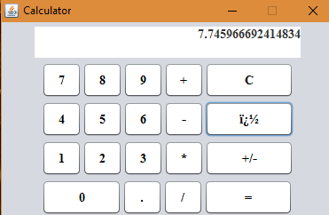

# Calculator

A JAVA Desktop Calculator Application. 
This is a simple calculator using Java Swing with an easy code to help novices learn how to create a calculator program with Java.

If you use the executable "Calculator.jar" file and it doesn't work, you can type `java-jar/calculator_directory/JavaCalculator.jar` in your terminal.
